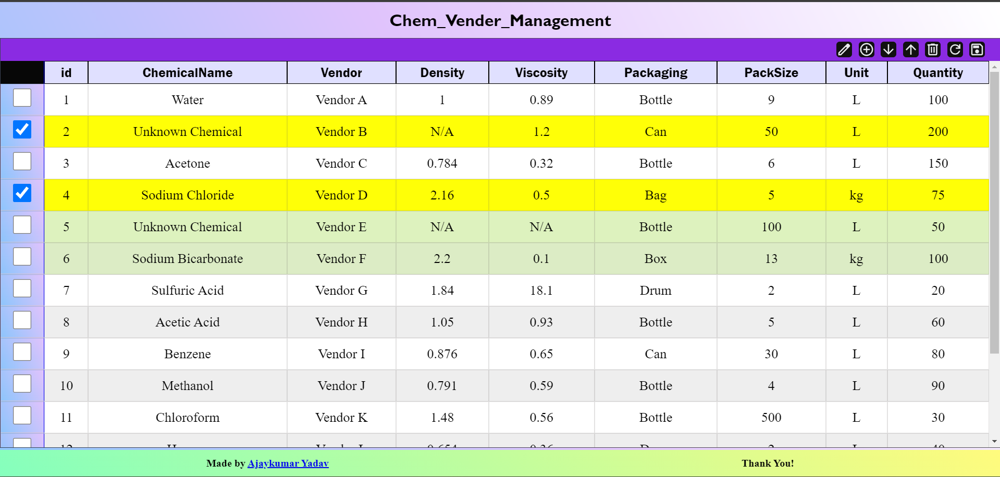

## Task Overview

This project have features **Custom Table with Controls** and **Overlay Module**. It allows dynamic table creation from fetched data and provides interactive overlays for notifications. Built with HTML, CSS, and JavaScript—no external dependencies.

# Project Link: [Click Here](https://chem-manage.onrender.com/)


## Features

- 0 External Dependencies  **(Pure HTML, CSS, and JavaScript) and can create N tables by single line of code because of modulerised code**
- Feature of **SORT** table based on column,  **ADD** a new Row, **DELETE** Row, **REFRESH/RESET** table, **SAVE** Table.

- **Reusable Modules, Functions, and Classes**: 
  - Two reusable classes and their functions:
    ```javascript
    1. CustomTable(parentElement, inputData, inputHeaders)
    2. Overlay(): have functions shopopup(message),
    ```
- **User Interaction**: Displays modal popups for messages and confirmations during operations on the table.
- **Responsive Design**: Responsive Design for small and large screen devices

## Example of Use
- import table module and CSS
```html
    <!-- importing css of self-made modules -->
    <link rel="stylesheet" href="./table_modules/table.css">
    <link rel="stylesheet" href="./table_modules/overlay_modules/overlay.css">

    <!-- importing js of self-made module -->
    <script src="./table_modules/table.mjs" type="module"></script>

```
```javascript

window.onload=function(){

    async function fetchDataAndBuildTable(){
        // fetching the data(array of the object)
        const inputata=await fetch('data.json').then(d=>d.json());

        //creating header=['id','chemicalname'.....]
        const inputheaders=Object.keys(inputata[0]);

        //selecting a element where the table will get injected;
        const parentElement=document.getElementById("table1");

        //this is costructer for the creating 
        const t=new CustomTable(parentElement,inputata,inputheaders);
    };

    fetchDataAndBuildTable();

}


```


## Modules Overview

### 1. CustomTable()

```javascript
const table = new CustomTable(parentElement, inputData, inputHeaders);
//constructor CustomTable(parentElement: domElement, inputata: Array(Object), headers: Array(String)): CustomTable
```

### 2. Overlay()
```javascript
const overlayObj=new Overlay();
// you can call follwing method of overlay

// (method) Overlay.showPopup(message: String): void

// (method) Overlay.getConfirmation(message: String, confirmText: String , cancelText: String , deleteFunction: function): void

// (method) Overlay.getEditResponse(message: Stirng, nameValueObj: Object, callback: function): void

//(method) Overlay.getAddResponse(message: String, headers: Array(string), callback: function): void

// (property) Overlay.popupCount: Number
```

## References

## References

- [MDN Docs](https://developer.mozilla.org/en-US/docs/Web/JavaScript): For help with JS DOM manipulation
- [Stack Overflow](https://stackoverflow.com): For fixing bugs
- [Google Search](https://www.google.com): For creation of `data.json`
- [ChatGPT](https://chatgpt.com): for the grammer correction of Document.
